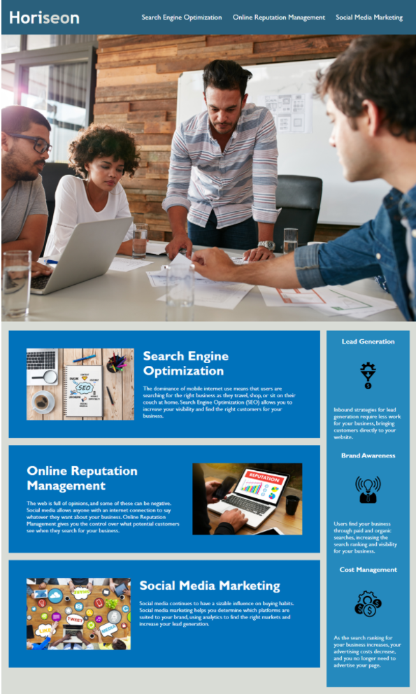

# Code Refactor Starter Code

* As a marketing agency, I want a codebase that follows accessibility standards
so that our own site is optimized for search engines.

## Description

* Starter code was provided by the mock company Horiseon which was altered to fit accessibility standards based on the criteria listed below. The website remained the same in looks and fuction, but by altering the code it is made more accessible to individuals with disabilities and improves the website for long-term sustainability. 

## Codebase Criteria

* It's done when there are semantic HTML elements in the source code.

* It's done when the structure of the HTML elemnts follow a logical structure independent of styling and positioning. 

* It's done when there are accessible alt attributes in the image elements. 

* It's done when the heading attributes fall in sequential order.

* It's done when the title element is concise and descriptive. 

## Screenshot

## URL
